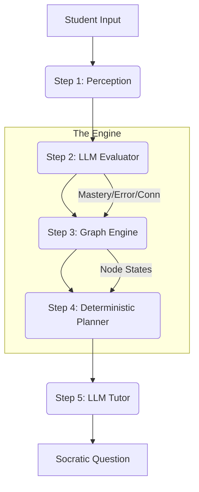

# Nanonautics ALS — Project Overview & Architecture

## 1. Philosophy: The Agentic Learning System (ALS)
Nanonautics ALS is a **zero-encouragement, high-reasoning Socratic tutor**. It rejects the "Chatbot" paradigm in favor of an **Agentic Cycle** where the LLM is restricted to specialized roles (Evaluation and Synthesis), while the core pedagogical strategy is governed by deterministic mathematical models and logic.

### Core Tenets:
- **Socratic Rigor**: The system never gives direct answers. It uses silence, probing questions, and technical observations to force student derivation.
- **Hebbian Mastery**: Skills are not just isolated stats; they are links in a neural web. Connecting concepts is rewarded more than rote correctness.
- **Tactical Noir Aesthetic**: The UI is designed to feel like a high-fidelity strategy tool, not a friendly classroom app. It prioritizes precision and "Information Density."

---

## 2. System Architecture: The 8-Step Cycle
Every student interaction follows a strict pipeline to ensure auditability and consistent pedagogical flow.



### AI Scannable logic Flow:
1.  **Perception**: Normalizes text (case, whitespace, noise removal).
2.  **Evaluation (LLM)**: Analyzes student input against "Expectations". Detects **Novel Connections** and identifies **Semantic Gaps**.
3.  **Graph Engine**: Updates Mastery ($m$), Confidence ($c$), Error Rate ($e$), and Edge Strength ($w$) using deterministic formulas.
4.  **Temporal Decay**: Applies exponential decay to mastery over time: $m_{new} = m_{old} \cdot e^{-\lambda \Delta t}$.
5.  **Planning**: Rules-based selection of one of 7 strategies (e.g., `CHALLENGE_MISCONCEPTION`, `BUILD_CONNECTION`).
6.  **Tutoring (LLM)**: Synthesizes the Planner's directive into a specific persona-driven response (Socratic, Nerdy, etc.).

---

## 3. Current Structure

### Backend (Python/FastAPI)
- **Engine**: Pure math found in `als_backend/agents/graph_engine.py`.
- **Memory**: JSON-file per student in `als_backend/student_graphs/`.
- **Knowledge**: ~240 nodes across STEAM fields (Science, Tech, Engineering, Arts, Math) defined in `als_backend/seed/concept_graph.py`.
- **Tuning**: All hyperparameters (learning rates, thresholds) centrally located in `als_backend/config.py`.

### Frontend (React/Vite)
- **Analytical Graph**: D3-based force-directed graph visualizing node mastery (size) and confidence (color).
- **HUD Interface**: A "Thinking Surface" (left) and "Architecture HUD" (right) providing real-time data on session deltas and error rates.
- **Modes**: Support for `Depth`, `Float`, `Drift`, and `Socratic` exploration paths.

---

## 4. UI/UX: Tactical Noir
The ALS user experience is optimized for **"State of Flow"** and **"Metacognitive Awareness."**

| Component | UX Purpose | Aesthetic Choice |
| :--- | :--- | :--- |
| **Thinking Surface** | Focused input area. | Glassmorphism, blurred backdrops, typography-first. |
| **Neural Graph** | Visualizing the mental model. | Floating orbs with "action potential" pulses on activation. |
| **Architecture HUD**| Data transparency. | Monospaced fonts, tactical badges, percentage-based deltas. |
| **Typewriter** | Pacing & focus. | Slow, rhythmic text reveal to encourage reading before typing. |

---

## 5. Metadata & Stats (AI Spec)
For AI agents simulating or modifying this system, use the following schema:

```json
{
  "node_state": {
    "mastery": "float [0.0 - 1.0]",
    "confidence": "float [0.0 - 1.0]", 
    "error_rate": "float [0.0 - 1.0]",
    "decay": "last applied factor",
    "tier": "difficulty gate [1 - 5]"
  },
  "unlock_logic": {
    "gate": "Mastery >= 0.40 AND Prereq_Edge >= 0.25",
    "tier_1": "Auto-unlocked foundations"
  },
  "steam_distribution": {
    "topics_per_field": "30-45",
    "total_nodes": "~240"
  }
}
```

---

## 6. Current State & Scale
- **Database**: Local JSON storage (scalable to Postgres/SQLite).
- **LLM**: Llama 3.3 70B (via Groq) for high-reasoning evaluator and tutor tasks.
- **Knowledge Density**: High. The graph covers comprehensive STEAM foundations with cross-links (e.g., `Calculus` $\rightarrow$ `Aerospace Engineering`).
